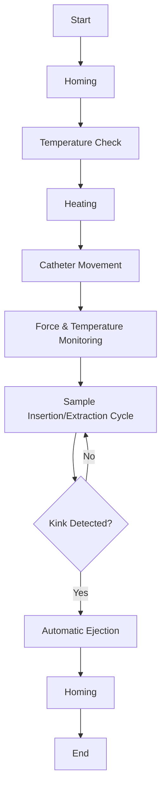
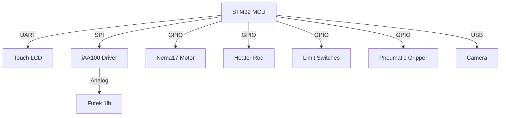

# Catheter Trackability Testing Machine — Firmware


<p align="center">
	
	
	
	
	
</p>

> **Precision firmware for automated catheter trackability testing — empowering medical device innovation.**

---


## 📑 Table of Contents

- [Overview](#overview)
- [Features](#features)
- [System Workflow](#system-workflow)
- [Hardware Components](#hardware-components)
- [Firmware Architecture](#firmware-architecture)
- [Installation & Setup](#installation--setup)
- [Usage](#usage)
- [Safety Notes](#safety-notes)
- [Roadmap](#roadmap)
- [Contributing](#contributing)
- [License](#license)
- [Acknowledgements](#acknowledgements)
- [Footer](#footer)

---


## 📝 Overview

The Catheter Trackability Testing Machine Firmware is a comprehensive, open-source embedded software solution designed to automate and standardize the measurement of catheter trackability in medical device testing. Trackability is a critical performance metric for catheters, reflecting their ability to navigate through tortuous anatomical pathways. This firmware enables precise, repeatable, and safe testing by integrating advanced hardware control, real-time monitoring, and user-friendly interfaces.

Developed for research laboratories, medical device manufacturers, and academic institutions, the firmware supports both manual and automatic operation modes. It provides granular control over all test parameters, ensures accurate data acquisition, and facilitates compliance with regulatory standards. The system is built to be extensible, allowing future enhancements such as wireless monitoring and AI-based analysis.

---


## ✨ Features

The firmware is designed to provide a full suite of features for catheter testing, ensuring flexibility, safety, and precision:

| Mode         | Capabilities                                                                 |
|--------------|------------------------------------------------------------------------------|
| **Manual**   | - **Stepper Motor Control:** Move the catheter forward or backward incrementally for fine positioning.<br>- **Heater Control:** Manually activate or deactivate the heater rod to maintain the test environment temperature.<br>- **Gripper Control:** Open or close the pneumatic gripper for secure catheter handling.<br>- **Homing Sequence:** Return all moving components to their safe home positions to prevent mechanical errors. |
| **Automatic**| - **Motor Speed Setting:** Define the catheter insertion/extraction speed in mm/sec for consistent testing.<br>- **Temperature Tracking:** Monitor and regulate the heater rod temperature in real-time, displayed on the HMI.<br>- **Kink Force Threshold:** Set a force limit (in Newtons) to detect catheter kinking and trigger automatic ejection.<br>- **Insertion Length:** Specify the total insertion length in mm for automated cycles.<br>- **Automatic Ejection:** System automatically ejects the catheter if a kink is detected, ensuring sample safety and repeatability. |

---


## 🔄 System Workflow

The firmware manages the entire catheter testing process through a well-defined sequence of operations, ensuring safety, accuracy, and repeatability. Below is a detailed breakdown of the workflow:

1. **Homing:** All moving components (motor, gripper) are returned to their home positions using limit switches to ensure a known, safe starting state.
2. **Temperature Check:** The system reads the heater rod temperature and verifies it is within the required range for testing. If not, the heater is activated.
3. **Heating:** The heater rod is controlled to reach and maintain the target temperature, monitored continuously via sensors.
4. **Catheter Movement:** The stepper motor drives the catheter according to user-defined parameters (speed, length), with real-time feedback.
5. **Force & Temperature Monitoring:** The load cell measures insertion/extraction force, while temperature is tracked throughout the test. Data is displayed on the HMI and logged for analysis.
6. **Sample Insertion/Extraction Cycle:** The system performs the full test cycle, moving the catheter in and out as specified.
7. **Automatic Ejection on Kink Detection:** If the measured force exceeds the kink threshold, the firmware triggers the pneumatic gripper to eject the catheter automatically, preventing damage.
8. **Return to Homing:** After test completion or ejection, all components return to their home positions, ready for the next cycle.



---


## 🛠️ Hardware Components

The system integrates several specialized hardware components, each playing a vital role in the testing process:

| Component                        | Role                | Description                                                                 |
|----------------------------------|---------------------|-----------------------------------------------------------------------------|
| **STM32429I Discovery Board**    | Main Controller     | High-performance microcontroller board that runs the firmware, orchestrates all hardware operations, and manages real-time data acquisition and processing. |
| **iAA100 Futek Load Cell Driver**| Signal Conditioning | Amplifies and digitizes the analog output from the load cell, ensuring accurate force measurements are communicated to the MCU. |
| **Futek 1lb Load Cell**          | Force Sensing       | Precision sensor for measuring the force exerted during catheter insertion and extraction, critical for kink detection and performance analysis. |
| **Nema17 Stepper Motor**         | Motion Control      | Provides precise, programmable movement of the catheter, enabling repeatable test cycles and accurate speed control. |
| **Heater Rod**                   | Temperature Control | Maintains the test environment at a specified temperature, simulating physiological conditions and ensuring consistent results. |
| **Limit Switches**               | Position Sensing    | Detects the home and end positions of moving components, preventing overtravel and ensuring safe operation. |
| **7-inch Touch HMI DWIN LCD**    | User Interface      | Intuitive touchscreen display for user interaction, parameter input, real-time status updates, and data visualization. |
| **Camera**                       | Monitoring          | Provides real-time visual feedback of the test process, allowing users to observe catheter behavior and verify system operation. |
| **Pneumatic Gripper**            | Sample Handling     | Automates the secure insertion and ejection of the catheter, improving test repeatability and operator safety. |

---


## 🧩 Firmware Architecture

The firmware is architected for reliability, modularity, and extensibility. Each subsystem is managed independently, with robust communication protocols ensuring seamless integration:

- **Control Logic:** Implements real-time control algorithms for the stepper motor, heater rod, pneumatic gripper, and limit switches. Ensures precise execution of test cycles, safety interlocks, and error handling.
- **HMI Interaction:** The 7-inch DWIN LCD touchscreen provides an intuitive interface for users to select operation modes, input test parameters, monitor live data (force, temperature, position), and receive alerts. The firmware manages all display updates and user inputs via UART communication.
- **Component Communication:** Utilizes UART for HMI, SPI for load cell driver, GPIO for motor, heater, gripper, and limit switches, and USB for camera integration. All data exchanges are validated for integrity and timing, ensuring reliable operation even under demanding test conditions.
- **Data Logging (future):** The architecture is designed to support future enhancements such as onboard data logging, wireless communication, and AI-based analysis modules.

<details>
<summary>📦 <b>Architecture Diagram (Mermaid)</b></summary>



</details>

---


## ⚡ Installation & Setup

Follow these steps to set up the Catheter Trackability Testing Machine Firmware and hardware for development and operation:

1. **Dependencies:**
	- **STM32CubeIDE (latest):** Official IDE for STM32 development, used for building and flashing the firmware.
	- **DWIN HMI Designer:** Software for designing and uploading custom GUIs to the DWIN LCD touchscreen.
	- **ST-Link Utility:** Tool for programming and debugging STM32 microcontrollers via ST-Link interface.
	- **Firmware Source Code:** Available in the [GitHub repository](https://github.com/AliHassan-019/Catheter-Trackability-Testing-Machine---Firmware).

2. **Clone Repository:**
	Clone the latest firmware source code to your local machine:
	```bash
	git clone https://github.com/AliHassan-019/Catheter-Trackability-Testing-Machine---Firmware.git
	```

3. **Build & Flash Firmware:**
	- Open the project in STM32CubeIDE.
	- Connect the STM32429I Discovery Board to your PC using the ST-Link programmer/debugger.
	- Build the project and flash the firmware onto the board.
	- Verify successful programming via the IDE console.

4. **HMI Setup:**
	- Use DWIN HMI Designer to create or modify the touchscreen GUI.
	- Upload the GUI to the DWIN LCD via UART or SD card as per manufacturer instructions.
	- Connect the LCD to the STM32 board using UART cables, ensuring correct pin mapping.

5. **Hardware Wiring:**
	- Refer to the provided [schematics](https://github.com/AliHassan-019/Catheter-Trackability-Testing-Machine---Firmware/tree/main/docs/schematics.pdf) for detailed wiring instructions.
	- Double-check all connections, especially power and signal lines, to prevent damage.
	- Ensure all limit switches, sensors, and actuators are securely mounted and connected.

6. **Initial Power-Up:**
	- Power on the system and observe the HMI for startup status.
	- Perform a homing sequence to verify all components are operational.

For troubleshooting and advanced setup, consult the [repository wiki](https://github.com/AliHassan-019/Catheter-Trackability-Testing-Machine---Firmware/wiki).

---


## 🚀 Usage

The firmware supports two primary modes of operation, each tailored for different testing requirements. Below are detailed instructions for both modes:

### Manual Mode

Manual mode allows the operator to control each hardware component individually for setup, calibration, or troubleshooting. Typical use cases include positioning the catheter, verifying sensor operation, and preparing the system for automated tests.

**Steps:**
1. Power on the system and wait for the HMI to display the main menu.
2. Select "Manual Mode" on the touchscreen.
3. Use the HMI controls to:
	- Move the stepper motor forward or backward in small increments for precise catheter placement.
	- Activate or deactivate the heater rod to reach the desired temperature.
	- Open or close the pneumatic gripper to insert or remove the catheter.
	- Initiate the homing sequence to reset all moving parts to their safe positions.
4. Monitor live feedback (force, temperature, position) on the HMI.
5. Use the emergency stop button or HMI control in case of unexpected behavior.

**Example Command Snippets:**
```c
// Move motor forward
send_command("MOTOR_FORWARD");
// Activate heater
send_command("HEATER_ON");
// Open gripper
send_command("GRIPPER_OPEN");
```

### Automatic Mode

Automatic mode executes a full test cycle based on user-defined parameters, ensuring repeatability and compliance with test protocols.

**Steps:**
1. Power on the system and select "Automatic Mode" on the HMI.
2. Enter test parameters:
	- Motor speed (mm/sec)
	- Target temperature (°C)
	- Kink force threshold (N)
	- Insertion length (mm)
3. Confirm settings and start the test.
4. The firmware will:
	- Perform homing and temperature checks automatically.
	- Control the stepper motor to insert/extract the catheter at the specified speed and length.
	- Monitor force and temperature in real-time, displaying data on the HMI.
	- Trigger automatic ejection if the force exceeds the kink threshold.
	- Log test results for review (future feature).
5. After completion, review the test summary on the HMI and prepare for the next cycle.

**Example Configuration:**
```json
{
  "motor_speed_mm_sec": 5,
  "temperature_C": 37,
  "kink_force_N": 2.5,
  "insertion_length_mm": 120
}
```

For advanced usage, troubleshooting, and custom test scripts, refer to the [repository documentation](https://github.com/AliHassan-019/Catheter-Trackability-Testing-Machine---Firmware/tree/main/docs).

---


---


## ⚠️ Safety Notes

> **Warning:**
> - **Electrical Safety:** Double-check all wiring and connections before powering on. Incorrect wiring can damage components or cause injury.
> - **Heater Rod:** The heater rod can reach high temperatures. Avoid direct contact and ensure the test area is clear of flammable materials.
> - **Pneumatic Gripper:** Operates under compressed air. Keep hands and loose clothing clear during operation. Always depressurize the system before maintenance.
> - **Limit Switches:** Ensure all limit switches are functional to prevent overtravel and mechanical damage.
> - **Emergency Stop:** The system is equipped with both hardware and HMI emergency stop controls. Familiarize yourself with their locations and operation before starting any test.
> - **General Precautions:** Only trained personnel should operate the machine. Follow all lab safety protocols and manufacturer guidelines for each hardware component.

---


## 🛣️ Roadmap

Planned and potential future improvements for the Catheter Trackability Testing Machine Firmware include:

- [ ] **Data Logging & Export:** Implement onboard and remote logging of test data, with export options (CSV, cloud integration) for analysis and regulatory compliance.
- [ ] **Wireless Monitoring:** Add Wi-Fi/Bluetooth modules for remote monitoring, control, and data access.
- [ ] **AI-Based Kink Detection:** Integrate machine learning algorithms to detect catheter kinking events more accurately and reduce false positives.
- [ ] **Multi-Catheter Support:** Enable simultaneous testing of multiple catheters for higher throughput and comparative studies.
- [ ] **Enhanced Safety Interlocks:** Add additional hardware and software safety features, such as redundant limit switches and real-time fault detection.
- [ ] **Remote Firmware Updates:** Support secure, over-the-air firmware updates for easier maintenance and feature deployment.
- [ ] **Expanded Documentation:** Provide more detailed guides, troubleshooting tips, and example test protocols in the repository wiki.

---


## 🤝 Contributing

Contributions are highly encouraged to improve the firmware, documentation, and hardware integration. To contribute:

1. **Fork the Repository:** Visit the [GitHub repository](https://github.com/AliHassan-019/Catheter-Trackability-Testing-Machine---Firmware) and click "Fork" to create your own copy.
2. **Clone Your Fork:**
	```bash
	git clone https://github.com/<your-username>/Catheter-Trackability-Testing-Machine---Firmware.git
	```
3. **Create a Feature Branch:**
	```bash
	git checkout -b feature/your-feature
	```
4. **Make Your Changes:**
	- Update code, documentation, or hardware guides as needed.
	- Ensure your changes are well-documented and tested.
5. **Commit and Push:**
	```bash
	git add .
	git commit -m "Describe your changes"
	git push origin feature/your-feature
	```
6. **Submit a Pull Request:**
	- Go to the original repository and open a pull request from your branch.
	- Provide a clear description of your changes and reference any related issues.

**Contribution Guidelines:**
- Follow the coding standards and documentation style used in the repository.
- For major changes, open an issue first to discuss your proposal.
- Ensure all new code is covered by tests (where applicable).
- Be respectful and collaborative in code reviews and discussions.

See [CONTRIBUTING.md](https://github.com/AliHassan-019/Catheter-Trackability-Testing-Machine---Firmware/blob/main/CONTRIBUTING.md) for more details.

---


## 📄 License

This project is open-source. The license will be finalized soon. For now, see the [LICENSE](https://github.com/AliHassan-019/Catheter-Trackability-Testing-Machine---Firmware/blob/main/LICENSE) file for details and updates.

---


## 🙏 Acknowledgements

Special thanks to the following organizations and communities for their support, hardware, and open-source resources:

- **Futek:** For providing high-precision load cells and signal conditioning solutions.
- **STMicroelectronics:** For the STM32 platform and development tools.
- **DWIN:** For the advanced HMI LCD modules and design software.
- **Open-Source Libraries & Contributors:** For code, documentation, and community support that make this project possible.
- **All contributors:** For their time, expertise, and dedication to improving the project.

---


## 🔗 Footer

- [GitHub Repository](https://github.com/AliHassan-019/Catheter-Trackability-Testing-Machine---Firmware)
- [Issues](https://github.com/AliHassan-019/Catheter-Trackability-Testing-Machine---Firmware/issues)
- [Discussions](https://github.com/AliHassan-019/Catheter-Trackability-Testing-Machine---Firmware/discussions)
- [Cite this project](https://github.com/AliHassan-019/Catheter-Trackability-Testing-Machine---Firmware)

<p align="center">
	<sub>Made with ❤️ for medical device innovation. For questions, support, or collaboration, visit the <a href="https://github.com/AliHassan-019/Catheter-Trackability-Testing-Machine---Firmware">GitHub repository</a>.</sub>
</p>
